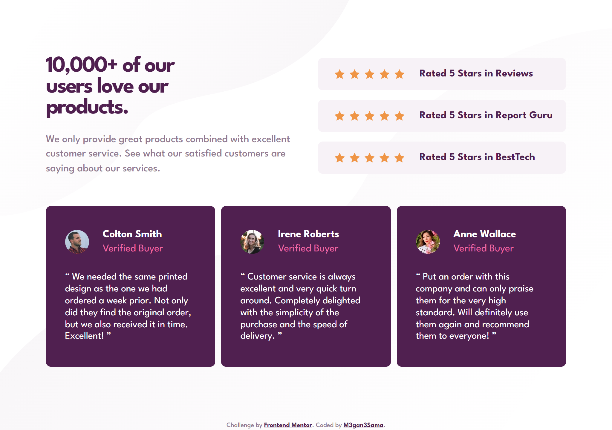
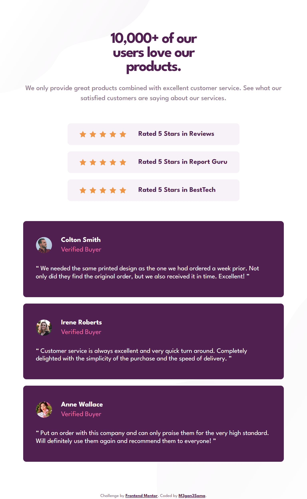
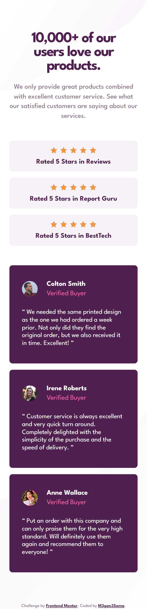

# Frontend Mentor - Social proof section

## Welcome! 👋

Thanks for checking out this front-end coding challenge.

This is my solution for this challenge

## Overview

### The challenge

The challenge was making a custom layout using HTML & CSS.
Honestly that was hard! 😂

### Screenshot
#### Desktop Preview:

  

#### Laptop Preview:

  

#### Tablet Preview:

  

#### Mobile Preview:

  

